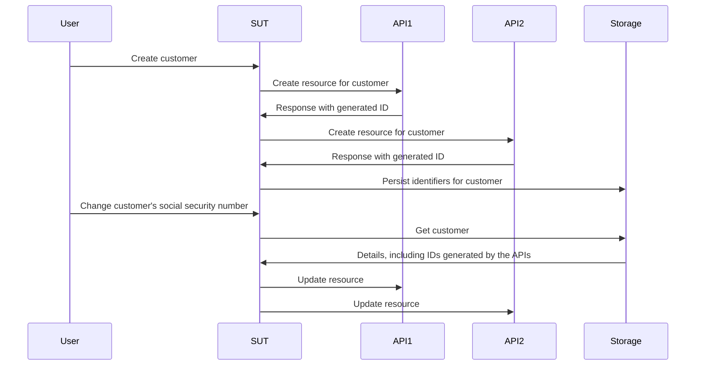

# Làm việc không cần mocks, stubs và spies

Chương này đi sâu vào thế giới của test doubles và khám phá cách chúng ảnh hưởng đến quy trình test và phát triển phần mềm. Chúng ta sẽ tìm hiểu những hạn chế của mocks, stubs và spies, đồng thời giới thiệu cách tiếp cận hiệu quả hơn bằng fakes và contracts.

## Tóm tắt (tl;dr)

- Mocks, spies và stubs khuyến khích bạn hardcode các giả định về hành vi của dependencies một cách tùy tiện trong mỗi bài test.
- Những giả định này thường không được xác minh ngoài việc kiểm tra thủ công, do đó chúng đe dọa tính hữu ích của bộ test.
- Fakes và contracts cung cấp phương pháp bền vững hơn để tạo test doubles với các giả định đã được xác thực và khả năng tái sử dụng tốt hơn.

Chương này dài hơn bình thường, do đó, để "khai vị", bạn nên khám phá trước một [kho lưu trữ ví dụ (example repo)](https://github.com/quii/go-fakes-and-contracts). Đặc biệt, hãy xem qua [bài test của planner](https://github.com/quii/go-fakes-and-contracts/blob/main/domain/planner/planner_test.go).

---

Trong chương [Mocking](https://quii.gitbook.io/learn-go-with-tests/go-fundamentals/mocking), chúng ta đã tìm hiểu cách mocks, stubs và spies trở thành những công cụ hữu ích để kiểm soát và kiểm tra hành vi của các unit of code kết hợp với [Dependency Injection](https://quii.gitbook.io/learn-go-with-tests/go-fundamentals/dependency-injection).

Tuy nhiên, khi dự án phát triển, những loại test doubles này *có thể* trở thành gánh nặng bảo trì, do đó chúng ta nên tìm kiếm các ý tưởng thiết kế khác để giữ cho hệ thống dễ hiểu và dễ test.

**Fakes** và **contracts** cho phép developer test hệ thống với các kịch bản thực tế hơn, cải thiện trải nghiệm phát triển local với feedback loop nhanh hơn, chính xác hơn, và quản lý được sự phức tạp của các dependencies không ngừng thay đổi.

### Khái quát về test doubles

Có thể bạn thấy nhàm chán khi phân biệt tên gọi các loại test doubles, nhưng việc phân loại rõ ràng giúp chúng ta thảo luận chính xác hơn và đưa ra quyết định tốt hơn.

**Test doubles** là thuật ngữ chung cho các cách thay thế dependencies để kiểm soát **subject under test (SUT)**. Dùng test doubles thường tốt hơn dùng dependencies thật vì giúp tránh các vấn đề như:

- Cần có internet để sử dụng một API
- Tránh độ trễ và các vấn đề về hiệu suất khác
- Không thể kích hoạt được các non-happy path cases
- Tách rời quá trình build code của bạn khỏi nhóm khác.
  - Bạn hẳn không muốn bị chặn deployment nếu một kỹ sư ở nhóm khác vô tình đưa ra một bug

Trong Go, bạn thường sẽ mô phỏng một dependency bằng một interface, sau đó implement phiên bản của riêng bạn để kiểm soát hành vi đó trong test. **Dưới đây là các loại test doubles được đề cập trong bài viết này**.

Cho trước interface của một API công thức nấu ăn giả định thế này:

```go
type RecipeBook interface {
	GetRecipes() ([]Recipe, error)
	AddRecipes(...Recipe) error
}
```

Chúng ta có thể cấu trúc các test doubles theo nhiều cách khác nhau, phụ thuộc vào mục đích chúng ta đang muốn kiểm tra thành phần sử dụng cái `RecipeBook` kia như thế nào.

**Stubs** trả về cùng một dữ liệu được định sẵn mỗi khi chúng được gọi

```go
type StubRecipeStore struct {
	recipes []Recipe
	err     error
}

func (s *StubRecipeStore) GetRecipes() ([]Recipe, error) {
	return s.recipes, s.err
}

// AddRecipes omitted for brevity
```

```go
// in test, we can set up the stub to always return specific recipes, or an error
stubStore := &StubRecipeStore{
	recipes: someRecipes,
}
```

**Spies** giống như stubs nhưng chúng cũng ghi lại cách chúng được gọi, vì vậy bài test có thể kiểm tra (assert) rằng SUT gọi các dependencies theo những cách cụ thể.

```go
type SpyRecipeStore struct {
	AddCalls [][]Recipe
	err      error
}

func (s *SpyRecipeStore) AddRecipes(r ...Recipe) error {
	s.AddCalls = append(s.AddCalls, r)
	return s.err
}

// GetRecipes omitted for brevity
```

```go
// in test
spyStore := &SpyRecipeStore{}
sut := NewThing(spyStore)
sut.DoStuff()

// now we can check the store had the right recipes added by inspectiong spyStore.AddCalls
```

**Mocks** giống như một tập hợp bao trùm những cái trên, nhưng chúng chỉ phản hồi bằng dữ liệu cụ thể đối với những lần gọi cụ thể. Nếu SUT gọi các dependencies với sai tham số (arguments), mocks thường sẽ gây ra panic.

```go
// set up the mock with expected calls
mockStore := &MockRecipeStore{}
mockStore.WhenCalledWith(someRecipes).Return(someError)

// when the sut uses the dependency, if it doesn't call it with someRecipes, usually mocks will panic
```

**Fakes** giống như một phiên bản thực sự của dependency nhưng được implement theo cách phù hợp hơn để chạy test nhanh, đáng tin cậy và phục vụ cho việc phát triển local. Thường thì hệ thống của bạn sẽ có một abstraction bao quanh tầng persistence, được implement bằng database, nhưng trong test bạn có thể dùng in-memory fake để thay thế.

```go
type FakeRecipeStore struct {
	recipes []Recipe
}

func (f *FakeRecipeStore) GetRecipes() ([]Recipe, error) {
	return f.recipes, nil
}

func (f *FakeRecipeStore) AddRecipes(r ...Recipe) error {
	f.recipes = append(f.recipes, r...)
	return nil
}
```

Fakes rất hữu ích vì:

- Tính stateful rất tiện lợi cho các bài test liên quan đến nhiều đối tượng và chuỗi lời gọi hàm, ví dụ như integration test. Việc quản lý state bằng các loại test doubles khác thường không được khuyến khích.
- Nếu chúng có API hợp lý, chúng cung cấp cách tự nhiên hơn để kiểm tra state. Thay vì spy các lời gọi cụ thể đến dependency, bạn có thể truy vấn state cuối cùng để xem kết quả mong muốn đã xảy ra chưa.
- Bạn có thể dùng chúng để chạy ứng dụng local mà không cần khởi động hay phụ thuộc vào dependencies thực. Điều này cải thiện DX vì fakes hoạt động nhanh hơn và ít gặp sự cố hơn so với thành phần thực tế.

Spies, Mocks và Stubs thường có thể được tạo tự động từ một interface bằng code generation hoặc reflection. Tuy nhiên, vì Fakes mô phỏng hành vi thực của dependency, bạn sẽ phải tự viết phần lớn implementation.


## Vấn đề với stubs và mocks

Trong phần [Anti-patterns](https://quii.gitbook.io/learn-go-with-tests/meta/anti-patterns), có nêu chi tiết về việc sử dụng test doubles phải cẩn thận như thế nào. Rất dễ tạo ra một mớ lộn xộn trong bộ test nếu bạn không dùng chúng hợp lý. Tuy nhiên, khi dự án phát triển, những vấn đề khác có thể nảy sinh.

Khi bạn encode behaviour vào test doubles, bạn đang đưa các giả định về cách dependency thực hoạt động vào trong test. Nếu có sự khác biệt giữa hành vi của test double và dependency thực, hoặc nếu điều này xảy ra theo thời gian (dependency thực thay đổi, điều này là tất yếu), **bạn có thể có test pass nhưng phần mềm lại bị lỗi**.

Stubs, spies và mocks mang đến nhiều thách thức khác, đặc biệt khi dự án phát triển lớn hơn. Để minh họa, tôi sẽ mô tả một dự án mà tôi đã tham gia.

### Case study

*Một số chi tiết đã được thay đổi so với thực tế, và nó đã được đơn giản hóa đi nhiều cho ngắn gọn. **Mọi sự trùng hợp với người thật, việc thật, đều là ngẫu nhiên.***

Tôi làm việc trong một hệ thống phải gọi tới **sáu** API khác nhau, được viết và duy trì bởi các team khác nhau trên toàn cầu. Các API này đều mang phong cách _REST-ish_, và công việc của hệ thống là tạo và quản lý resource trong tất cả các API đó. Khi chúng tôi gọi tất cả API đúng cách, *phép màu* (business value) sẽ xảy ra.

Ứng dụng của chúng tôi được tổ chức theo kiến trúc hexagonal / ports & adapters. Domain code được decouple hoàn toàn khỏi sự lộn xộn của thế giới bên ngoài. Các "adapters" thực chất là các Go clients dùng để đóng gói quá trình gọi các API khác nhau.


#### Những rắc rối

Tự nhiên, chúng tôi chọn cách tiếp cận test-driven để xây dựng hệ thống. Chúng tôi dùng stubs để mô phỏng các phản hồi từ API downstream và có một vài acceptance tests để tự tin rằng mọi thứ sẽ hoạt động.

Tuy nhiên, hầu hết các API mà chúng tôi phải gọi đều:

- Có document rất nghèo nàn
- Do các team đang ngập đầu trong các ưu tiên khác, nên kiếm thời gian nói chuyện với họ rất khó
- Thường thiếu test coverage, vì vậy chúng sẽ hỏng hóc, regress theo những cách bất ngờ
- Vẫn đang trong quá trình xây dựng và thay đổi liên tục

Điều này dẫn đến **rất nhiều flaky tests** và kéo theo nhiều phen đau đầu. Một lượng thời gian _đáng kể_ bị ngốn vào việc ping rất nhiều người bận rộn trên Slack, cố gắng tìm câu trả lời cho:

- Tại sao API lại bắt đầu trả về `x`?
- Tại sao API lại làm điều gì đó khác khi chúng tôi thực hiện `y`?

Phát triển phần mềm hiếm khi suôn sẻ như mong đợi; đó là quá trình vừa học vừa làm. Chúng tôi phải liên tục học cách các API bên ngoài hoạt động. Xuyên suốt quá trình đó, chúng tôi phải cập nhật test suite, cụ thể là **thay đổi stubs để khớp với hành vi thực tế của các API.**

Rắc rối là việc này ngốn hầu hết thời gian và dẫn tới nhiều sai sót. Khi hiểu biết về một dependency thay đổi, bạn phải tìm **đúng** test để cập nhật stub, và rủi ro bỏ sót luôn cao vì bạn có thể quên cập nhật các stub khác cùng mock cho chung dependency đó.

#### Test strategy

Khi hệ thống lớn dần và requirement liên tục thay đổi, chúng tôi nhận ra rằng test strategy không còn phù hợp. Chúng tôi có vài acceptance test cho toàn bộ hệ thống, và một số lượng lớn unit test cho các package khác nhau.

<u>Chúng tôi cần thứ gì đó ở giữa</u>; chúng tôi thường muốn thay đổi hành vi của nhiều phần trong hệ thống cùng lúc **nhưng không muốn phải khởi động *toàn bộ* hệ thống cho một acceptance test**. Unit tests không đủ để chứng minh các thành phần hoạt động tốt với nhau; chúng không thể verify câu chuyện mà chúng tôi đang hướng tới. **Chúng tôi cần integration tests**.

#### Integration tests

Integration tests chứng minh rằng hai hay nhiều "units" hoạt động chính xác khi kết hợp lại với nhau. Các units này có thể là code của bạn, hoặc code của bạn tích hợp với thứ do người khác viết, ví dụ database.

Khi dự án lớn dần, bạn sẽ cần viết thêm integration tests để chứng minh các phần lớn hơn trong hệ thống hoạt động tốt khi kết hợp với nhau.

Bạn có thể muốn viết thêm black-box acceptance tests, nhưng chúng sẽ sớm trở nên tốn kém về thời gian build và chi phí bảo trì. Có thể quá đắt để khởi động toàn bộ hệ thống khi bạn chỉ muốn kiểm tra một *subset* (nhưng không chỉ 1 unit) xem nó có hoạt động đúng chưa. Nhồi nhét black-box tests cho mọi chức năng không phải là cách bền vững cho các hệ thống lớn.

#### Fakes

Vấn đề là các unit test của chúng tôi phụ thuộc vào stubs, mà stubs bản chất là *stateless*. Chúng tôi muốn viết test bao phủ nhiều API calls *stateful*, nơi chúng tôi có thể tạo một resource rồi sau đó chỉnh sửa nó.

Dưới đây là phiên bản rút gọn của bài test mà chúng tôi muốn thực hiện.

SUT là "service layer" xử lý các request use case. Chúng tôi muốn chứng minh rằng khi một khách hàng được tạo và thông tin của họ thay đổi, chúng tôi cũng cập nhật thành công các resource ở các API liên quan.

Đây là requirement được cung cấp cho team dưới dạng user story.

> ***Given*** người dùng đăng ký với API 1, 2 và 3
>
> ***When*** social security number của khách hàng được thay đổi
>
> ***Then*** thay đổi đó được cập nhật vào các APIs 1, 2 và 3



Các test chạy xuyên qua nhiều units thường không tương thích với stubs **vì stubs không phù hợp cho việc maintaining state**. Chúng tôi _có thể_ viết black-box acceptance test, nhưng chi phí sẽ nhanh chóng vượt tầm kiểm soát.

Thêm vào đó, việc test edge cases bằng black-box test rất phức tạp vì bạn không thể kiểm soát dependencies. Ví dụ, chúng tôi muốn chứng minh rằng cơ chế rollback sẽ kích hoạt khi một lệnh gọi API gặp lỗi.

Chúng tôi cần **fakes**. Bằng cách mô hình hóa dependencies thành stateful APIs với in-memory fakes, chúng tôi có thể viết integration tests với phạm vi rộng hơn nhiều, **kiểm tra các use case thực tế có hoạt động không**, *mà không cần* spin up toàn bộ hệ thống, với tốc độ nhanh tương đương unit tests.


Bằng cách sử dụng fakes, **chúng ta có thể assert dựa trên final state của các hệ thống thay vì phụ thuộc vào spying phức tạp**. Chúng ta hỏi từng fake những record mà nó lưu giữ cho khách hàng đó và assert xem chúng đã được update chưa. Điều này tự nhiên hơn; nếu kiểm tra thủ công, chúng ta sẽ truy vấn các API để xem state của chúng, chứ không đi soi request logs xem đã gửi đúng JSON payload chưa.

```go
// take our lego-bricks and assemble the system for the test
fakeAPI1 := fakes.NewAPI1()
fakeAPI2 := fakes.NewAPI2() // etc..
customerService := customer.NewService(fakeAPI1, fakeAPI2, etc...)

// create new customer
newCustomerRequest := NewCustomerReq{
	// ...
}
createdCustomer, err := customerService.New(newCustomerRequest)
assert.NoErr(t, err)

// we can verify all the details are as expected in the various fakes in a natural way, as if they're normal APIs
fakeAPI1Customer := fakeAPI1.Get(createdCustomer.FakeAPI1Details.ID)
assert.Equal(t, fakeAPI1Customer.SocialSecurityNumber, newCustomerRequest.SocialSecurityNumber)

// repeat for the other apis we care about

// update customer
updatedCustomerRequest := NewUpdateReq{SocialSecurityNumber: "123", InternalID: createdCustomer.InternalID}
assert.NoErr(t, customerService.Update(updatedCustomerRequest))

// again we can check the various fakes to see if the state ends up how we want it
updatedFakeAPICustomer := fakeAPI1.Get(createdCustomer.FakeAPI1Details.ID)
assert.Equal(t, updatedFakeAPICustomer.SocialSecurityNumber, updatedCustomerRequest.SocialSecurityNumber)
```

Cách làm này vừa đơn giản để viết, vừa dễ đọc hơn nhiều so với việc kiểm tra các argument của function call bằng spies.

Cách tiếp cận này cho phép chúng ta có test chạy xuyên phần lớn hệ thống, viết các bài test **có ý nghĩa** xoay quanh những use case mà đội đang bàn tới mỗi lúc stand-up, mà vẫn chạy cực nhanh.

#### Fakes và lợi ích của encapsulation

Quay lại ví dụ trên, các bài test không cần quan tâm dependencies hoạt động như thế nào, chỉ cần verify end state. Chúng ta tạo fake version của dependency và inject chúng vào phần hệ thống đang test.

Nếu dùng mocks/stubs, chúng ta phải set up mỗi dependency để xử lý từng scenario cụ thể, trả về dữ liệu đặc thù, v.v. Việc này đưa cả behaviour lẫn implementation details vào trong test, làm suy yếu encapsulation.

Chúng ta mô hình hóa dependencies sau interface nên với tư cách client, _ta không cần quan tâm nó hoạt động ra sao_, nhưng với cách tiếp cận "mockist", _ta bắt buộc phải quan tâm **trong từng test***.

#### Chi phí bảo trì của fakes

Fakes tốn công hơn các loại test doubles khác, ít nhất về lượng code; chúng phải duy trì state và mô phỏng hành vi của thứ chúng đang fake. Mọi sự sai lệch giữa fake và "hàng thật" đều **mang theo rủi ro** rằng test trật nhịp với thực tế. Điều này dẫn đến tình huống test pass trơn tru, nhưng phần mềm thực sự đang lỗi.

Bất cứ khi nào bạn tích hợp với hệ thống ngoài - API từ team khác hay database - bạn sẽ đưa ra các assumptions về cách nó hoạt động. Đây là những giả định thu thập được từ API docs, các cuộc trò chuyện, email hay tin nhắn Slack...

Sẽ rất tốt nếu ta có thể **codify các assumptions** và chạy chúng trên cả fake *lẫn* hệ thống thực để kiểm tra tự động xem kiến thức của chúng ta có đúng không, theo cách repeatable?

**Contracts** chính là giải pháp. Chúng giúp quản lý các assumptions về hệ thống của team khác một cách rõ ràng. Và điều đó luôn hữu ích hơn hàng loạt email lộn xộn hay những chuỗi chat Slack không bao giờ dứt!


Có contract trong tay, ta có thể yên tâm dùng fake thay cho dependency thật một cách interchangeable. Cách này hữu ích cho cả test lẫn local development.

Dưới đây là ví dụ về contract cho một API mà hệ thống phụ thuộc vào
 
```go
type API1Customer struct {
	Name string
	ID   string
}

type API1 interface {
	CreateCustomer(ctx context.Context, name string) (API1Customer, error)
	GetCustomer(ctx context.Context, id string) (API1Customer, error)
	UpdateCustomer(ctx context.Context, id string, name string) error
}

type API1Contract struct {
	NewAPI1 func() API1
}

func (c API1Contract) Test(t *testing.T) {
	t.Run("can create, get and update a customer", func(t *testing.T) {
		var (
			ctx  = context.Background()
			sut  = c.NewAPI1()
			name = "Bob"
		)

		customer, err := sut.CreateCustomer(ctx, name)
		expect.NoErr(t, err)

		got, err := sut.GetCustomer(ctx, customer.ID)
		expect.NoErr(t, err)
		expect.Equal(t, customer, got)

		newName := "Robert"
		expect.NoErr(t, sut.UpdateCustomer(ctx, customer.ID, newName))

		got, err = sut.GetCustomer(ctx, customer.ID)
		expect.NoErr(t, err)
		expect.Equal(t, newName, got.Name)
	})

	// example of strange behaviours we didn't expect
	t.Run("the system will not allow you to add 'Dave' as a customer", func(t *testing.T) {
		var (
			ctx  = context.Background()
			sut  = c.NewAPI1()
			name = "Dave"
		)

		_, err := sut.CreateCustomer(ctx, name)
		expect.Err(t, ErrDaveIsForbidden)
	})
}
```

Như đã thảo luận trong [Mở rộng Acceptance Tests](https://quii.gitbook.io/learn-go-with-tests/testing-fundamentals/scaling-acceptance-tests), bằng cách test dựa trên interface thay vì concrete type, bài test trở nên:

- Decoupled khỏi implementation bên dưới
- Có thể tái sử dụng trong nhiều ngữ cảnh khác nhau.

Đó chính là yêu cầu cần thiết cho contract. Nó cho phép chúng ta xác minh và phát triển fake _và_ đồng thời dùng nó để kiểm tra implementation thực tế.

Để tạo bản in-memory fake, chúng ta có thể sử dụng contract trong một bài test.

```go
func TestInMemoryAPI1(t *testing.T) {
	API1Contract{NewAPI1: func() API1 {
		return inmemory.NewAPI1()
	}}.Test(t)
}
```

Và đây là code của fake đó

```go
func NewAPI1() *API1 {
	return &API1{customers: make(map[string]planner.API1Customer)}
}

type API1 struct {
	i         int
	customers map[string]planner.API1Customer
}

func (a *API1) CreateCustomer(ctx context.Context, name string) (planner.API1Customer, error) {
	if name == "Dave" {
		return planner.API1Customer{}, ErrDaveIsForbidden
	}

	newCustomer := planner.API1Customer{
		Name: name,
		ID:   strconv.Itoa(a.i),
	}
	a.customers[newCustomer.ID] = newCustomer
	a.i++
	return newCustomer, nil
}

func (a *API1) GetCustomer(ctx context.Context, id string) (planner.API1Customer, error) {
	return a.customers[id], nil
}

func (a *API1) UpdateCustomer(ctx context.Context, id string, name string) error {
	customer := a.customers[id]
	customer.Name = name
	a.customers[id] = customer
	return nil
}
```

### Evolving software

Hầu hết phần mềm không được xây dựng xong chỉ trong một lần release.

Đó là quá trình học hỏi liên tục, thích ứng với nhu cầu khách hàng và thay đổi bên ngoài. Trong ví dụ trước, các API cũng đang thay đổi; và trong quá trình phát triển phần mềm của _chính mình_, chúng tôi cũng hiểu thêm về hệ thống mà mình _thực sự_ cần tạo ra. Những assumptions trong contracts hóa ra sai hoặc _đã trở nên_ sai.

May mắn thay, một khi đã thiết lập xong contracts, chúng tôi có phương pháp đơn giản để đối phó với thay đổi. Khi có kiến thức mới, do bug được sửa hoặc đồng nghiệp thông báo API sẽ thay đổi, chúng tôi sẽ:

1. Viết test cho kịch bản mới. Điều này yêu cầu sửa contract nhằm **drive** bạn mô phỏng lại hành vi tương ứng trong fake.
2. Test sẽ fail, nhưng trước đó hãy chạy contract với dependency thực để đảm bảo thay đổi là hợp lệ.
3. Cập nhật fake để tuân thủ contract.
4. Chỉnh sửa code để test pass.
5. Refactor.
6. Chạy tất cả test và ship.

Việc chạy _toàn bộ_ test suite trước khi check in _có thể_ khiến một số test khác fail do fake giờ có hành vi khác. Điều này là **điều tốt**! Bạn có thể tiếp tục sửa lỗi ở các phần khác trong hệ thống (những phần phụ thuộc vào dependency vừa được cập nhật); bạn cũng tự tin rằng chúng sẽ xử lý đúng trong production. Nếu không có cách tiếp cận này, bạn phải tự *nhớ* rà soát mọi test liên quan để cập nhật stubs. Việc này dễ mắc lỗi, cực nhọc và nhàm chán.

### Trải nghiệm lập trình viên vượt trội

Sở hữu fakes đi kèm contracts mang lại cảm giác như có siêu năng lực. Cuối cùng, chúng tôi có thể làm chủ sự phức tạp của vô số API phải đối mặt hàng ngày.

Việc viết test cho các kịch bản khác nhau trở nên đơn giản hơn nhiều. Chúng tôi không còn phải chắp vá một loạt stubs và spies ở mỗi bài test; giờ đây chúng tôi có thể dùng các module (fakes, services) rồi lắp ráp chúng dễ dàng để mô phỏng các kịch bản đa dạng.

Mỗi bài test dùng stub, spy hay mock luôn phải _bận tâm_ hệ thống bên ngoài chạy thế nào, do cách set up ad-hoc. Trái lại, fakes được đối xử như bất kỳ unit code nào có encapsulation tốt, mọi chi tiết đã được giấu gọn, và bạn chỉ việc lấy ra dùng.

Chúng tôi có thể khởi chạy phiên bản rất sát thực tế của hệ thống trên máy local, và vì mọi thứ chạy in-memory, ứng dụng khởi động cực nhanh. Thời gian chạy test rất ngắn, mang lại trải nghiệm ấn tượng, đặc biệt khi chạy toàn bộ suite.

Nếu acceptance tests fail trên staging, bước đầu tiên chúng tôi làm là chạy contracts đối chiếu với API bên thứ ba. Thường thì chúng tôi phát hiện lỗi **trước cả khi developer của đội kia tự phát hiện ra**.

### Test lỗi (off the happy path) với decorators

Trong error scenarios, stubs thuận tiện hơn vì bạn có toàn quyền kiểm soát *cách nó hoạt động* ngay trong test, trong khi fakes thiên về black-box. Đây là thiết kế có chủ đích: người dùng (tức test) không cần quan tâm cách fake vận hành; họ tin tưởng nó hoạt động đúng nhờ contract bảo đảm.

Vậy làm thế nào để fake trả về lỗi, nhằm test non-happy path?

Có nhiều tình huống bạn cần tinh chỉnh behaviour của code mà không được sửa code gốc. **Decorator pattern** thường được dùng để wrap một unit code và thêm các lớp chức năng phụ trợ như logging, telemetry, retries... Chúng ta cũng có thể dùng cách này wrap fake để override behaviour khi cần.

Quay lại ví dụ `API1`, ta có thể tạo một type implement cùng interface, đồng thời wrap fake.

```go
type API1Decorator struct {
	delegate           API1
	CreateCustomerFunc func(ctx context.Context, name string) (API1Customer, error)
	GetCustomerFunc    func(ctx context.Context, id string) (API1Customer, error)
	UpdateCustomerFunc func(ctx context.Context, id string, name string) error
}

// assert API1Decorator implements API1
var _ API1 = &API1Decorator{}

func NewAPI1Decorator(delegate API1) *API1Decorator {
	return &API1Decorator{delegate: delegate}
}

func (a *API1Decorator) CreateCustomer(ctx context.Context, name string) (API1Customer, error) {
	if a.CreateCustomerFunc != nil {
		return a.CreateCustomerFunc(ctx, name)
	}
	return a.delegate.CreateCustomer(ctx, name)
}

func (a *API1Decorator) GetCustomer(ctx context.Context, id string) (API1Customer, error) {
	if a.GetCustomerFunc != nil {
		return a.GetCustomerFunc(ctx, id)
	}
	return a.delegate.GetCustomer(ctx, id)
}

func (a *API1Decorator) UpdateCustomer(ctx context.Context, id string, name string) error {
	if a.UpdateCustomerFunc != nil {
		return a.UpdateCustomerFunc(ctx, id, name)
	}
	return a.delegate.UpdateCustomer(ctx, id, name)
}
```

Trong test code, chúng ta có thể set field `XXXFunc` để override behaviour của test double này, tương tự stubs, spies và mocks.

```go
failingAPI1 = NewAPI1Decorator(inmemory.NewAPI1())
failingAPI1.UpdateCustomerFunc = func(ctx context.Context, id string, name string) error {
	return errors.New("failed to update customer")
}
```

Tuy vậy, cách này khá *khiên cưỡng*. Bạn đang phá vỡ guarantees từ contract bởi vì đã đưa ad-hoc behaviour lên trên fake.

Cách tốt nhất là xem xét context tổng thể. Với unhappy paths, thường nên quay lại dùng stub ở cấp unit test cho đơn giản và dễ bảo trì.

### Lượng code bổ sung này có phải là lãng phí không?

Thật thiển cận khi tin rằng chúng ta chỉ nên viết code phục vụ trực tiếp khách hàng và kỳ vọng sẽ có hệ thống hiệu quả. Mọi người thường có góc nhìn sai lệch về sự lãng phí (xem bài viết của tôi: [The ghost of Henry Ford is ruining your development team](https://quii.dev/The_ghost_of_Henry_Ford_is_ruining_your_development_team)).

Automated tests không mang lại lợi ích trực tiếp cho khách hàng, nhưng chúng ta viết chúng để giúp bản thân làm việc hiệu quả hơn (bạn không viết test chỉ để chạy theo coverage, đúng không?).

Kỹ sư cần khả năng mô phỏng kịch bản dễ dàng (repeatable, không phải ad-hoc) để debug, test và sửa lỗi. **In-memory fakes và thiết kế module tốt cho phép cô lập các actors liên quan cho một kịch bản nhất định, từ đó viết test nhanh, chính xác và ít tốn kém**. Sự linh hoạt này cho phép developer tinh chỉnh ứng dụng dễ kiểm soát hơn nhiều so với black-box test tốn kém, hoặc tệ hơn, test thủ công trên shared environment.

Đây là ví dụ của [simple vs. easy](https://www.youtube.com/watch?v=SxdOUGdseq4). Fakes và contracts đòi hỏi nhiều code hơn stubs và spies trong ngắn hạn, nhưng kết quả là hệ thống tinh gọn hơn và tiết kiệm chi phí bảo trì dài hạn. Cập nhật spies, stubs và mocks chắp vá là công việc thủ công mệt mỏi và dễ lỗi, vì bạn không có contracts để xác thực rằng test doubles đang hoạt động đúng.

Cách tiếp cận này yêu cầu chi phí trả trước _tăng nhẹ_ nhưng tiết kiệm hơn hẳn khi contracts và fakes đã được thiết lập xong. Fakes tái sử dụng được và đáng tin cậy hơn stubs ad-hoc.

Điều này tạo ra cảm giác *cực kỳ* tự do và củng cố **confidence** mỗi khi dùng fake đã được kiểm chứng, thay vì phải cấu hình lại stub mỗi khi viết test mới.

### Cách này tích hợp vào phương thức TDD ra sao?

Tôi sẽ không khuyên bạn _bắt đầu_ với contract; làm vậy mang tính bottom-up design, và tôi thấy mình phải suy nghĩ nhiều hơn theo cách này, đồng thời có nguy cơ overthink vào các hypothetical requirements.

Kỹ thuật này đi cùng với acceptance test driven approach như đã thảo luận tại các chương trước, như trong bài [The Why of TDD](https://quii.dev/The_Why_of_TDD) và cuốn [GOOS](http://www.growing-object-oriented-software.com)

- Tạo [acceptance test](https://quii.gitbook.io/learn-go-with-tests/testing-fundamentals/scaling-acceptance-tests) fail.
- Viết code đủ để pass. Thường điều này sẽ tạo ra service layer phụ thuộc vào API, database, v.v. Business logic sẽ được decouple khỏi persistence và dependency bên ngoài qua interface.
- Tạo in-memory fake implement interface đó để chạy test local nhanh.
- Khi chuẩn bị cho production, bạn không dùng in-memory fake! Hãy đóng gói các assumptions cho fake vào contract.
- Dùng contract để drive implementation thực, ví dụ kết nối tới MySQL.
- Ship.

## Chương hướng dẫn test database đâu rồi?

Đây là một câu hỏi thường gặp mà tôi đã phải trì hoãn trả lời trong hơn năm năm qua. Lý do là vì chương này sẽ luôn là câu trả lời của tôi cho câu hỏi đó.

<u>Đừng mock database driver và cũng đừng spy các lời gọi hàm</u>. Những bài test này rất khó viết và mang lại ít giá trị. Bạn không nên test xem một câu lệnh `SQL` cụ thể có được gửi vào database hay không - đó là implementation detail; **test chỉ nên quan tâm đến behaviour**. Chứng minh một câu SQL được gửi đi _không hề_ chứng minh được rằng code đang _hoạt động_ đúng.

**Contracts** buộc bạn phải decouple test khỏi implementation details và chỉ tập trung vào behaviour.

Hãy tuân theo phương pháp TDD như đã thảo luận ở trên để xây dựng persistence cho dự án của bạn.

[Repo ví dụ](https://github.com/quii/go-fakes-and-contracts) có chứa ví dụ về contracts, cũng như cách dùng chúng để test cả implementation in-memory và SQLite cho persistence.

```go
package inmemory_test

import (
	"github.com/quii/go-fakes-and-contracts/adapters/driven/persistence/inmemory"
	"github.com/quii/go-fakes-and-contracts/domain/planner"
	"testing"
)

func TestInMemoryPantry(t *testing.T) {
	planner.PantryContract{
		NewPantry: func() planner.Pantry {
			return inmemory.NewPantry()
		},
	}.Test(t)
}
```

```go
package sqlite_test

import (
	"github.com/quii/go-fakes-and-contracts/adapters/driven/persistence/sqlite"
	"github.com/quii/go-fakes-and-contracts/domain/planner"
	"testing"
)

func TestSQLitePantry(t *testing.T) {
	client := sqlite.NewSQLiteClient()
	t.Cleanup(func() {
		if err := client.Close(); err != nil {
			t.Error(err)
		}
	})

	planner.PantryContract{
		NewPantry: func() planner.Pantry {
			return sqlite.NewPantry(client)
		},
	}.Test(t)
}
```

Mặc dù Docker giúp chạy database trên máy local dễ dàng hơn, vẫn có performance overhead đáng kể. Fakes kết hợp contracts cho phép bạn hạn chế tần suất dùng dependency "nặng", chỉ dùng khi cần validate contract, không cần cho các loại test khác.

Dùng in-memory fakes trong acceptance tests và integration tests cho *phần còn lại* của hệ thống sẽ nhanh và dễ dàng hơn nhiều cho developer.

## Tổng kết

Các dự án phần mềm thường có nhiều đội nhóm cùng xây dựng các hệ thống song song hướng tới mục tiêu chung.

Cách làm việc này đòi hỏi hợp tác và giao tiếp cao. Nhiều người nghĩ rằng với cách tiếp cận "API first", chúng ta có thể làm rõ API contracts - thường trên wiki page! - rồi làm việc độc lập sáu tháng, sau đó ghép mọi thứ lại. Điều đó hiếm khi thành công, bởi vì khi bắt đầu viết code, chúng ta hiểu sâu hơn về bài toán và domain, và điều này đánh đổ các assumptions ban đầu. Chúng ta phải điều chỉnh theo kiến thức mới, đòi hỏi cross-team changes.

Nếu bạn ở trong hoàn cảnh tương tự, bạn cần cấu trúc code và test tối ưu để đối phó với những thay đổi khó lường, cả bên trong lẫn bên ngoài hệ thống.

> “Một trong những đặc điểm tiêu biểu nhất của các team làm phần mềm đạt hiệu suất cao (high-performing teams) là khả năng không ngừng tiến bước và sự linh hoạt tự do thay đổi các sáng kiến của riêng họ mà không cần phải đi xin xỏ phê duyệt từ bất kỳ cá nhân hay hội nhóm nào bên ngoài nhóm nhỏ của họ.”
>
> Modern Software Engineering
> David Farley

Đừng chỉ trông cậy vào cuộc họp hàng tuần hay Slack threads để làm rõ chi tiết. **Hãy codify assumptions của nhóm bằng contracts**. Chạy contracts trong build pipeline; nhóm sẽ nhận được feedback nhanh khi có thông tin mới. Contracts cùng **fakes** cho phép bạn làm việc độc lập và quản lý thay đổi từ bên ngoài một cách bền vững.

### Hệ thống của bạn dưới hình chiếu là một tổ hợp các modules

Liên hệ lại với ý tưởng trong cuốn sách của Farley, tôi đang diễn giải đến khái niệm **phát triển hệ thống mở rộng dần (incrementalism)**. Xây dựng phần mềm vốn là một vòng lặp *học hỏi dài kỳ (constant learning exercise)*. Sẽ rất thiếu tính thực tế nếu yêu cầu nhóm phải hiểu được trọn vẹn toàn bộ các yêu cầu bài toán (the requirements) để mang lại chuỗi giá trị (deliver value) ngay từ những bước cấu trúc ban đầu (up-front). Thay vào đó, chúngामु ta phải liên tục tối ưu hoá hệ thống và cách thức vận hành để **liên tục thu thập thông tin phản hồi siêu tốc và tạo tính thử nghiệm linh hoạt (gather feedback quickly and experiment)**.

Bạn cần một **hệ thống có tính module hóa (modular system)** nhằm phát huy lợi thế từ những khái niệm được vạch ra trong chương học này. Nếu nắm giữ các đoạn code module gắn chặt với lớp fakes đáng tin cậy, nó sẽ cung cấp cho bạn cơ hội được thử nghiệm (experiment) trên hệ thống thông qua các bài test tự động với chi phí cực kỳ tiết kiệm.

Chúng tôi nhận thấy việc chuyển đổi những kịch bản kỳ quặc, giả định (nhưng có khả năng xảy ra) vào trong các bài test độc lập (self-contained tests) trở nên vô cùng dễ dàng. Việc này giúp chúng tôi hiểu nội tại vấn đề và phát triển phần mềm mạnh mẽ vững chắc hơn bằng cách lắp ghép các module lại với nhau rồi chạy thử các cấu trúc dữ liệu đa dạng theo các vòng thứ tự xen kẽ khác nhau, hay mô phỏng một số API bị lỗi, v.v.

Các module được thiết kế rõ ràng và được test bao phủ tốt sẽ cho phép bạn nâng cấp hệ thống liên tục mà không còn nỗi lo phải sửa đổi hay cần am hiểu về _tất cả mọi thứ (everything)_ trong cùng một thời điểm.

### Nhưng tôi đang làm việc trên một dự án nhỏ với các API ổn định

Ngay cả với các API đã ổn định, bạn cũng không nên để trải nghiệm với tư cách dev (developer experience), các tiến trình code builds, v.v vô tình dính chặt (tightly coupled) với phần mã code của người khác. Khi bạn áp dụng đúng phương pháp tiếp cận này, bạn sẽ nhận được một bộ các module có khả năng lắp ráp tùy ý để xây dựng nền phần mềm chạy trên môi trường thực tiễn (production), hoặc khởi chạy trên máy local, hoặc thiết lập khả năng viết các loại bài test khác nhau với các bản thay thế (doubles) mà bạn tin cậy.

Cách tiếp cận này cho phép bạn cô lập riêng phân lớp chức năng bạn quan tâm trong hệ thống và yên tâm viết các bài kiểm định logic có ý nghĩa phục vụ tập trung thẳng vào vấn đề thực sự mà nhóm dự án đang cần giải.

### Đưa các thành phần phụ thuộc (dependencies) lên hàng "công dân hạng nhất (first-class citizens)"

Tuy vậy, stubs hay spies dĩ nhiên vẫn có chỗ đứng cho riêng chúng. Việc mô phỏng ad-hoc các hành vi xử lý đa dạng của các cụm phân nhánh dependencies trong bài test sẽ luôn có góc độ hữu dụng nhất định, tuy thế, hãy cẩn thận đừng để chi phí bảo trì của chúng vượt ra tầm kiểm soát (costs go out of control).

Nhìn lại chặng đường nghề nghiệp, tôi đã chứng kiến không ít codebase được viết rất cẩn thận bởi các dev tài năng, cuối cùng lại sụp đổ vì integration problems. Tích hợp rất khó _bởi vì_ việc mô phỏng chính xác hành vi của hệ thống do người khác xây dựng là gần như bất khả, khi mà chính những người viết code đó cũng liên tục thay đổi hệ thống.

Nhiều đội ngũ quá trông cậy dồn code lên chạy ở một môi trường giả định chung (shared environment) và dựa lưng vào kết quả test trên đó. Nhược điểm của hướng tiếp cận này là nó không đem tới khả năng chạy bắt **kết quả kiểm định phản hồi một cách cô lập (isolated)**, cộng thêm chu kỳ nhận kết quả **thực chất rất chậm (feedback is slow)**. Bằng cách đó, bạn lại càng không có khả năng kiến tạo hay dựng lên vô số những cấu hình hệ kịch bản thử nghiệm (experiments) đa dạng để đo lường cách thức hệ thống của bạn phối kết với các luồng dependencies nhánh khác vận hành ra sao, hoạ may nếu có thì tính hiệu quả là cực thấp.  

**Chúng ta bắt buộc phải khắc chế triệt để cấu trúc phức tạp này qua thao tác chuyển đổi định hướng áp dụng những tư duy phức hợp tỉ mỉ hơn trong việc mô hình hóa các dependencies** nhằm tăng tốc phục vụ giai đoạn diễn tập và test chéo trên máy tính cá nhân dev trước thời khoảnh khắc hệ phần mềm được tung ra môi trường chốt (production). Hãy kiến tạo nhóm mô thức fakes giả lập độ chân thực và khả năng quản lý tốt nhất dành cho dependencies phụ trợ; tiếp đến là bảo chứng chất lượng dựa theo hợp đồng contracts. Rồi đến một lúc khi mọi sự hoàn chỉnh, bạn khởi mào viết thêm nhiều và ngày càng nhiều lớp test sát sườn đi liền vô vàn hình thử nghiệm đa dạng ngay trên lớp phần mềm của dự án thì chắc chắn điểm tới của bạn sẽ tiệm cận thành công mỹ mãn.
