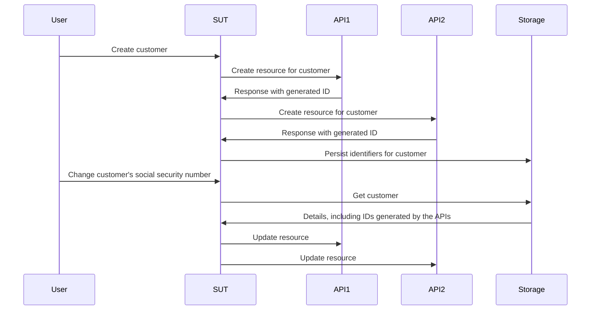

# Làm việc không cần mocks, stubs và spies

Chương này đi sâu vào thế giới của test doubles (các đối tượng thay thế trong kiểm thử) và khám phá cách chúng ảnh hưởng đến quy trình kiểm thử và phát triển phần mềm. Chúng ta sẽ khám phá những hạn chế của các phương pháp truyền thống như mocks, stubs và spies, đồng thời giới thiệu một cách tiếp cận hiệu quả và dễ thích ứng hơn bằng cách sử dụng fakes và contracts.

## Tóm tắt (tl;dr)

- Mocks, spies và stubs khuyến khích bạn mã hóa các giả định về hành vi của các dependencies (phụ thuộc) một cách tùy tiện trong mỗi bài test.
- Những giả định này thường không được xác minh vượt ra ngoài việc kiểm tra thủ công, do đó, chúng đe dọa đến tính hữu ích của bộ test của bạn.
- Fakes và contracts cung cấp cho chúng ta một phương pháp bền vững hơn để tạo test doubles với các giả định đã được xác thực và khả năng tái sử dụng tốt hơn so với các lựa chọn thay thế.

Chương này dài hơn bình thường, do đó, để "khai vị", bạn nên khám phá trước một [kho lưu trữ ví dụ (example repo)](https://github.com/quii/go-fakes-and-contracts). Đặc biệt, hãy xem qua [bài test của planner](https://github.com/quii/go-fakes-and-contracts/blob/main/domain/planner/planner_test.go).

---

Trong chương [Mocking](https://quii.gitbook.io/learn-go-with-tests/go-fundamentals/mocking), chúng ta đã tìm hiểu cách mocks, stubs và spies trở thành những công cụ hữu ích để kiểm soát và kiểm tra hành vi của các đơn vị mã (units of code) kết hợp với [Dependency Injection](https://quii.gitbook.io/learn-go-with-tests/go-fundamentals/dependency-injection) (Tiêm phụ thuộc).

Tuy nhiên, khi dự án phát triển, những loại test doubles này *có thể* trở thành một gánh nặng bảo trì, do đó chúng ta nên tìm kiếm các ý tưởng thiết kế khác để giữ cho hệ thống của mình dễ dàng suy luận và kiểm thử.

**Fakes** (đối tượng giả) và **contracts** (hợp đồng) cho phép các nhà phát triển kiểm thử hệ thống của họ với các kịch bản thực tế hơn, cải thiện trải nghiệm phát triển cục bộ với các chu trình phản hồi (feedback loops) nhanh hơn, chính xác hơn, và quản lý được sự phức tạp của các dependencies không ngừng thay đổi.

### Khái quát về test doubles

Thật dễ để tỏ vẻ chán nản khi những người như tôi cứ hay xét nét về cách gọi tên của test doubles, nhưng các loại test doubles mang tính đặc thù giúp chúng ta thảo luận về chủ đề này và đưa ra những quyết định cân nhắc một cách tường minh hơn.

**Test doubles** là danh từ chung cho các cách khác nhau mà bạn có thể cấu trúc các dependencies nhầm kiểm soát một **chủ thể đang được kiểm thử** (**subject under test** - viết tắt là **SUT**), tức là thứ mà bạn đang kiểm tra. Việc dùng Test doubles thường ưu việt hơn là dùng các dependencies thật vì nó có thể giúp tránh được các rắc rối như:

- Cần có internet để sử dụng một API
- Tránh độ trễ và các vấn đề về hiệu suất khác
- Không thể kích hoạt được các trường hợp không đi theo luồng chuẩn (non-happy path cases)
- Tách rời quá trình build mã của bạn khỏi nhóm khác.
  - Bạn hẳn không muốn bị chặn quy trình triển khai (deployment) nếu một kỹ sư ở nhóm khác vô tình đưa ra một lỗi (bug)

Trong Go, bạn thường sẽ mô phỏng một dependency bằng một interface, sau đó triển khai phiên bản của riêng bạn (implement) để kiểm soát hành vi đó trong một test. **Dưới đây là các loại test doubles được đề cập trong bài viết này**.

Cho trước interface của một API công thức nấu ăn giả định thế này:

```go
type RecipeBook interface {
	GetRecipes() ([]Recipe, error)
	AddRecipes(...Recipe) error
}
```

Chúng ta có thể cấu trúc các test doubles theo nhiều cách khác nhau, phục thuộc vào mục đích chúng ta đang muốn kiểm tra thành phần sử dụng cái `RecipeBook` kia như thế nào.

**Stubs** trả về cùng một dữ liệu được định sẵn mỗi khi chúng được gọi

```go
type StubRecipeStore struct {
	recipes []Recipe
	err     error
}

func (s *StubRecipeStore) GetRecipes() ([]Recipe, error) {
	return s.recipes, s.err
}

// AddRecipes omitted for brevity
```

```go
// in test, we can set up the stub to always return specific recipes, or an error
stubStore := &StubRecipeStore{
	recipes: someRecipes,
}
```

**Spies** giống như stubs nhưng chúng cũng ghi lại cách chúng được gọi, vì vậy bài test có thể kiểm tra (assert) rằng SUT gọi các dependencies theo những cách cụ thể.

```go
type SpyRecipeStore struct {
	AddCalls [][]Recipe
	err      error
}

func (s *SpyRecipeStore) AddRecipes(r ...Recipe) error {
	s.AddCalls = append(s.AddCalls, r)
	return s.err
}

// GetRecipes omitted for brevity
```

```go
// in test
spyStore := &SpyRecipeStore{}
sut := NewThing(spyStore)
sut.DoStuff()

// now we can check the store had the right recipes added by inspectiong spyStore.AddCalls
```

**Mocks** giống như một tập hợp bao trùm những cái trên, nhưng chúng chỉ phản hồi bằng dữ liệu cụ thể đối với những lần gọi cụ thể. Nếu SUT gọi các dependencies với sai tham số (arguments), mocks thường sẽ gây ra panic.

```go
// set up the mock with expected calls
mockStore := &MockRecipeStore{}
mockStore.WhenCalledWith(someRecipes).Return(someError)

// when the sut uses the dependency, if it doesn't call it with someRecipes, usually mocks will panic
```

**Fakes** giống như một phiên bản thực sự của dependency nhưng được triển khai theo cách phù hợp hơn để chạy các bài test một cách nhanh chóng, đáng tin cậy và phục vụ cho việc phát triển ở môi trường cục bộ (local). Thường thì hệ thống của bạn sẽ có một lớp trừu tượng bao quanh tầng lưu trữ dữ liệu (persistence), lớp này sẽ được triển khai bằng một database, nhưng trong các bài test, bạn có thể sử dụng một fake lưu trữ trong bộ nhớ (in-memory fake) để thay thế.

```go
type FakeRecipeStore struct {
	recipes []Recipe
}

func (f *FakeRecipeStore) GetRecipes() ([]Recipe, error) {
	return f.recipes, nil
}

func (f *FakeRecipeStore) AddRecipes(r ...Recipe) error {
	f.recipes = append(f.recipes, r...)
	return nil
}
```

Fakes rất hữu ích vì:

- Trạng thái của chúng (statefulness) rất tiện lợi cho các bài test liên quan đến nhiều đối tượng và các chuỗi lời gọi hàm, ví dụ như trong integration test. Việc quản lý trạng thái bằng các loại test doubles khác thường không được khuyến khích.
- Nếu chúng có một API hợp lý, chúng cung cấp một cách tự nhiên hơn để kiểm tra trạng thái. Dễ hơn là việc theo dõi (spying) các cuốc gọi cụ thể đến dependency nào đó, bạn có thể truy vấn trạng thái cuối cùng của nó để xem kết quả thực sự bạn muốn đã xảy ra chưa.
- Bạn có thể sử dụng chúng để chạy ứng dụng của mình cục bộ mà không cần phải khởi động hay phụ thuộc vào các dependencies thực. Điều này thường sẽ cải thiện trải nghiệm lập trình viên (DX) vì fakes sẽ hoạt động nhanh hơn và ít gặp sự cố hơn so với các thành phần thực tế tương ứng.

Spies, Mocks và Stubs thường có thể được tạo tự động từ một interface bằng cách sử dụng các công cụ rà quét hoặc reflection. Tuy nhiên, vì Fakes tóm lược một cụm hành vi của một dependency mà bạn đang cố tạo bản sao cho nó, bạn sẽ phải tự mình viết phần lớn implementation (chạy bên trong) cho ẻm.


## Vấn đề với stubs và mocks

Trong phần [Anti-patterns](https://quii.gitbook.io/learn-go-with-tests/meta/anti-patterns), có nêu chi tiết về việc sử dụng test doubles phải được thực hiện cẩn thận như thế nào. Rất dễ tạo ra một mớ lộn xộn trong bộ test nếu bạn không sử dụng chúng một cách có gu (tastefully). Tuy nhiên, khi dự án phát triển, những vấn đề khác có thể len lỏi vào.

Khi bạn mã hóa các hành vi (encode behaviour) vào trong test doubles, bạn đang đưa các giả định của mình về cách dependency thực hoạt động vào trong test. Nếu có sự khác biệt giữa hành vi của test double và dependency thực, hoặc nếu điều này xảy ra theo thời gian (ví dụ: dependency thực bị thay đổi, điều này là tất yếu), **bạn có thể có các bài test pass nhưng phần mềm lại bị lỗi**.

Stubs, spies và mocks, nói riêng, mang đến nhiều thách thức khác, chủ yếu là khi dự án phát triển lớn hơn. Để minh họa điều này, tôi sẽ mô tả một dự án mà tôi đã tham gia.

### Ví dụ thực tế (Case study)

*Một số chi tiết đã được thay đổi so với thực tế, và nó đã được đơn giản hóa đi nhiều cho ngắn gọn. **Mọi sự trùng hợp với người thật, việc thật, đều là ngẫu nhiên.***

Tôi làm việc trong một hệ thống phải gọi tới **sáu** API khác nhau, được viết và duy trì bởi các team khác nhau trên toàn cầu. Các API này đều mang phong cách _REST-ish_ (giống REST), và công việc của hệ thống của chúng tôi là tạo và quản lý tài nguyên trong tất cả các API đó. Khi chúng tôi gọi tất cả API đúng cách cho từng hệ thống, *phép màu* (business value - giá trị doanh nghiệp) sẽ xảy ra.

Ứng dụng của chúng tôi được tổ chức theo kiến trúc hexagonal / ports & adapters. Phần domain code của chúng tôi được tách biệt (decoupled) hoàn toàn với sự lộn xộn của thế giới bên ngoài mà chúng tôi phải xử lý. Các "adapters" của chúng tôi, thực chất, là các Go clients dùng để đóng gói quá trình gọi các API khác nhau.


#### Những rắc rối

Tự nhiên thay, chúng tôi chọn cách tiếp cận test-driven (hướng kiểm thử) để xây dựng hệ thống. Chúng tôi tận dụng stubs để mô phỏng (simulate) các phản hồi từ API downstream và có một vài bài acceptance tests để tự tin rằng mọi thứ sẽ hoạt động trơn tru.

Tuy nhiên, hầu hết các API mà chúng tôi phải gọi đều:

- Có tài liệu (document) rất nghèo nàn
- Do các team đang ngập đầu trong các ưu tiên và áp lực khác vận hành, nên kiếm thời gian nói chuyện với họ rất khó
- Thường thiếu test coverage (độ phủ test), vì vậy chúng sẽ hỏng hóc, lỗi lùi (regress) theo những cách rất bất ngờ và quái đản
- Vẫn đang trong quá trình xây dựng và thay đổi liên tục

Điều này dẫn đến **rất nhiều bài test lúc pass lúc fail (flaky tests)** và kéo theo nhiều phen đau đầu. Một lượng thời gian _đáng kể_ của chúng tôi bị ngốn vào việc ping rất nhiều người bận rộn trên Slack, cố gắng tìm câu trả lời cho:

- Tại sao API lại bắt đầu trả về `x`?
- Tại sao API lại làm điều gì đó khác khi chúng tôi thực hiện `y`?

Phát triển phần mềm hiếm khi suôn sẻ như bạn mong đợi; đó là một quá trình vừa học vừa làm. Chúng tôi đã phải liên tục học cách các API bên ngoài hoạt động. Xuyên suốt quá trình học và điều chỉnh, chúng tôi lại phải cập nhật và thêm bớt vào bộ test suite của mình, cụ thể là **thay đổi stubs của chúng tôi để khớp với hành vi thực tế của các API.**

Rắc rối ở chỗ, việc này ngốn hầu hết thời gian của chúng tôi và dẫn tới nhiều sai sót hơn. Khi hiểu biết của bạn về một dependency thay đổi, bạn phải tìm **đúng** test để cập nhật sửa lại hành vi của stub, và rủi ro bỏ sót luôn ở mức cao ở chỗ bạn quên cập nhật cho các stub khác cùng mock cho chung một dependency đó.

#### Chiến lược Test (Test strategy)

Chưa kể, khi hệ thống đang lớn mạnh dần lên và các requirement (yêu cầu) cứ liên tục thay đổi, chúng tôi nhận ra rằng test strategy của mình không còn phù hợp nữa. Chúng tôi có một vài bài acceptance test để tạo sự tự tin rằng toàn bộ hệ thống hoạt động tốt, và sau đó là một số lượng lớn unit test cho các package khác nhau mà chúng tôi đã viết.

<u>Chúng tôi cần thứ gì đó ở giữa</u>; chúng tôi thường muốn thay đổi hành vi của nhiều phần trong hệ thống cùng với nhau **nhưng lại không muốn phải khởi động *toàn bộ* hệ thống dành riêng cho một bài acceptance test**. Chỉ riêng Unit tests thì chưa cung cấp đủ độ tin cậy chứng tỏ các thành phần hoạt động trơn tru với nhau như một khối thống nhất; chúng không thể nói lên (và verify) câu chuyện mà chúng tôi đang đạt tới. **Chúng tôi cần integration tests (kiểm thử tích hợp)**.

#### Integration tests

Integration tests chứng minh rằng hai hay nhiều "units" có thể hoạt động chính xác khi kết hợp (hay tích hợp!) lại cùng nhau. Các units này có thể là phần code của bạn viết, hoặc code do bạn viết tích hợp cùng thứ được viết bởi ai đó khác, như là database chẳng hạn.

Khj dự án phình to, bạn sẽ cần viết thêm integration tests để chứng minh những phần to lớn trong hệ thống "kết dính" với nhau hoàn hảo - hay gọi là integrates!

Bạn có thể cảm nhận được sự thôi thúc phải viết thêm những bài black-box acceptance tests (test nghiệm thu hộp đen), nhưng chúng sẽ sớm trở nên đắt đỏ về thời gian build và chi phí bảo trì. Có thể sẽ quá tốn kém để làm việc với toàn bộ hệ thống khi bạn chỉ muốn kiểm tra một *phân mảnh nhỏ (subset)* của hệ thống đó (nhưng không chỉ là 1 unit) xem nó có hoạt động đúng đắn chưa. Việc nhét một đống black-box tests tốn phí cho mọi chức năng bạn làm không phải là phương châm bền vững cho các hệ thống lớn.

#### Fakes

Vấn đề là cách các unit của chúng tôi được unit test lại phụ thuộc vào stubs, mà stubs bản chất lại thường mang hệ *không trạng thái (stateless)*. Chúng tôi muốn viết những test bao phủ nhiều API calls *có dính dáng đến trạng thái (stateful)*, nơi chúng tôi có thể tạo một resource ở lúc đầu và sau đó chỉnh sửa lại nó.

Bên dưới là một phiên bản rút gọn của bài test mà chúng tôi muốn thực hiện.

Mục tiêu SUT là "service layer" xử lý các request "use case". Chúng tôi muốn chứng minh là nếu một khách hàng được tạo, khi thông tin của họ thay đổi, chúng tôi cũng cập nhật thành công các resources chúng tôi đã tạo ở các API liên đới.

Dưới đây là các yêu cầu được cung cấp cho team dưới dạng một user story (câu chuyện người dùng).

> ***Cho trước (Given)*** người dùng đăng ký với API 1, 2 và 3 
>
> ***Khi (When)*** mã số an sinh xã hội (social security number) của khách hàng được thay đổi
>
> ***Thì (Then)*** thay đổi đó được cập nhật vào các APIs 1, 2 và 3



Các bài tests chạy xuyên qua nhiều units thường không tương thích với stubs **bởi lẽ bọn hắn hoàn toàn không phù hợp cho việc duy trì trạng thái (maintaining state)**. Chúng tôi _có thể_ viết một bài black-box acceptance test, nhưng chi phí cho các bài test này sẽ nhanh chóng vượt ra ngoài tầm kiểm soát.

Thêm vào đó, việc kiểm thử các góc khuất (edge cases) bằng một con black-box test là rất phức tạp vì bạn không thể kiểm soát các dependencies. Ví dụ, chúng tôi muốn chứng minh rằng cơ chế rollback (hoàn tác) sẽ bắt đầu nếu một lệnh gọi API gặp lỗi.

Chúng tôi cần dùng **fakes**. Bằng cách mô hình hóa các dependencies của chúng tôi thành stateful APIs cùng các in-memory fakes, chúng tôi có thể viết integration tests theo phạm vi rộng hơn nhiều, **cho phép chúng tôi kiểm tra các use case thực tế có hoạt động không**, và một lần nữa *mà không cần* động tới toàn bộ hệ thống (spin up the whole system), đổi lại tốc độ chạy test nhanh tương đương như unit tests.


Bằng cách sử dụng fakes, **chúng ta có thể thực hiện kiểm tra (assertions) dựa trên trạng thái sau cùng (final states) của các hệ thống tương ứng thay vì phụ thuộc vào việc spying phức tạp**. Chúng ta sẽ hỏi từng fake những bản ghi (records) mà nó lưu giữ cho vị khách hàng đó là gì và kiểm tra (assert) xem chúng đã được update chưa. Điều này có vẻ tự nhiên hơn; nếu chúng ta kiểm tra hệ thống của mình theo cách thủ công (manually check), chúng ta sẽ truy vấn các API đó để kiểm tra trạng thái của chúng, chứ không phải đi săm soi request logs của chúng ta xem thử ta đã bắn đi đúng định dạng JSON payloads chưa.

```go
// take our lego-bricks and assemble the system for the test
fakeAPI1 := fakes.NewAPI1()
fakeAPI2 := fakes.NewAPI2() // etc..
customerService := customer.NewService(fakeAPI1, fakeAPI2, etc...)

// create new customer
newCustomerRequest := NewCustomerReq{
	// ...
}
createdCustomer, err := customerService.New(newCustomerRequest)
assert.NoErr(t, err)

// we can verify all the details are as expected in the various fakes in a natural way, as if they're normal APIs
fakeAPI1Customer := fakeAPI1.Get(createdCustomer.FakeAPI1Details.ID)
assert.Equal(t, fakeAPI1Customer.SocialSecurityNumber, newCustomerRequest.SocialSecurityNumber)

// repeat for the other apis we care about

// update customer
updatedCustomerRequest := NewUpdateReq{SocialSecurityNumber: "123", InternalID: createdCustomer.InternalID}
assert.NoErr(t, customerService.Update(updatedCustomerRequest))

// again we can check the various fakes to see if the state ends up how we want it
updatedFakeAPICustomer := fakeAPI1.Get(createdCustomer.FakeAPI1Details.ID)
assert.Equal(t, updatedFakeAPICustomer.SocialSecurityNumber, updatedCustomerRequest.SocialSecurityNumber)
```

Cách làm này vừa đơn giản để viết, vừa dễ đọc hơn nhiều so với việc kiểm tra các argument khác nhau của function call bằng spies.

Cách tiếp cận này cho phép chúng ta có các bài test chéo qua phần lớn hệ thống, cho phép ta viết các bài test **có ý nghĩa (meaningful)** xoay quanh những use case mà đội ngũ đang bàn tới mỗi lúc stand-up mà vẫn giữ được cái tốc độ thực thi cực kỳ nhanh (exceptionally quickly).  

#### Fakes mang đến nhiều hơn những lợi ích từ sự đóng gói (encapsulation)

Quay lại ví dụ trên, các bài test không bị bận tâm bằng cách nào các dependencies hoạt động ngoài mặt kiểm tra trạng thái cuối cùng của nó (verifying their end state). Chúng ta tạo ra các fake version của dependency và nhét (inject) chúng vào vùng hệ thống mà chúng ta đang test.

Nếu là dùng mocks/stubs, chúng ta đã phải dàn dựng (set up) mỗi phần dependency để làm sao xử lý một kịch bản nhất định (scenarios), trả về các dữ liệu đặc thù nào đó, v.v. Việc này đã mang cả hành vi (behavior) lẫn chi tiết triển khai (implementation details) vào trong test, làm suy yếu đi lợi ích cấu trúc đóng gói (encapsulation). 

Chúng ta mô hình hóa các dependencies ẩn sau các interface thế nên, mang tư cách là người gọi hàm (clients), _ta không cần e dè ngó ngàng việc nó hoạt động ra làm sao (we don't have to care how it works)_, nhưng với cái hướng tiếp cận hệ "mockist" (mô phỏng bằng mọi giá), _ta bắt buộc phải để mắt mọi việc **trên từng chặng test (in every test)***.

#### Chi phí bảo trì của fakes

Fakes thì sẽ tốn phí hơn các nhóm test doubles khác, ít nhất là về lượng code viết ra; chúng phải gánh vác việc ghi nhớ tình trạng (state) và mô phỏng được hành vi của bất kỳ thứ gì chúng đang fake. Mọi sự sai lệch trong hành vi giữa bản fake của bạn và bản "hàng thật" đều **mang theo rủi ro (carry a risk)** rằng phần code test của bạn trật nhịp với thực tế. Điều này dẫn đến sự cố thường gặp là bạn có các bài test thi nhau trả ra kết quả xanh (pass) trơn tru, mà phần mềm thì thực sự đang lỗi phần lõi.

Bất cứ khi nào bạn được yêu cầu phải tích hợp (integrate) với hệ thống ngoài, giả dụ một cái API đến từ team khác hay cả một nhóm database, bạn đều sẽ nhào theo xu hướng bấu víu vài phán đoán (assumptions) rập khuôn trên cách thức nó hoạt động. Và đây là những thứ giả định mà bạn có thể nhặt, bắt, lấy được qua quá trình rà đọc tài liệu API docs, vài câu đối thoại mồm, email hay những tệp trao đổi trên Slack, tin nhắn công ty...

Không phải sẽ rất tốt sao nếu ta có thể **mã hóa lại các giả định (codify our assumptions)** và cho phép chạy đồng bộ xuyên suốt cả bản fake *lẫn* hệ thống thực để kiểm tra tự động xem là kiến thức của chúng ta có thực sự đứng vững trên một phương thức cho phép lặp lại dễ dàng (repeatable) hay không? 

Và **Contracts** chính là cánh cửa dẫn tới con đường này. Chúng giúp chúng ta quản lý các phán đoán trên hệ thống của team khác được phơi bày một cách dứt khoát. Và một nền tảng bộc lộ theo hướng dứt khoát thì luôn hữu ích hơn là hàng lô email lộn xộn hay những chuỗi chat trên Slack không bao giờ vơi!


Có trong tay một Contract, ta có có thể mặc định rằng mình luôn có thể an toàn dùng fake thay cho dependency đời thực và đổi qua lại dễ dàng (interchangeably). Cách này không những hữu hiệu trong mục tiêu thiết lập chạy mớ test mà cho cả trên cục bộ lúc phát triển - the local development.

Dưới đây là một ví dụ về một cái contract bao thầu cho 1 cục API nằm trong chuỗi mà hệ thống phải phụ thuộc
 
```go
type API1Customer struct {
	Name string
	ID   string
}

type API1 interface {
	CreateCustomer(ctx context.Context, name string) (API1Customer, error)
	GetCustomer(ctx context.Context, id string) (API1Customer, error)
	UpdateCustomer(ctx context.Context, id string, name string) error
}

type API1Contract struct {
	NewAPI1 func() API1
}

func (c API1Contract) Test(t *testing.T) {
	t.Run("can create, get and update a customer", func(t *testing.T) {
		var (
			ctx  = context.Background()
			sut  = c.NewAPI1()
			name = "Bob"
		)

		customer, err := sut.CreateCustomer(ctx, name)
		expect.NoErr(t, err)

		got, err := sut.GetCustomer(ctx, customer.ID)
		expect.NoErr(t, err)
		expect.Equal(t, customer, got)

		newName := "Robert"
		expect.NoErr(t, sut.UpdateCustomer(ctx, customer.ID, newName))

		got, err = sut.GetCustomer(ctx, customer.ID)
		expect.NoErr(t, err)
		expect.Equal(t, newName, got.Name)
	})

	// example of strange behaviours we didn't expect
	t.Run("the system will not allow you to add 'Dave' as a customer", func(t *testing.T) {
		var (
			ctx  = context.Background()
			sut  = c.NewAPI1()
			name = "Dave"
		)

		_, err := sut.CreateCustomer(ctx, name)
		expect.Err(t, ErrDaveIsForbidden)
	})
}
```

Như đã thảo luận trong [Mở rộng Acceptance Tests](https://quii.gitbook.io/learn-go-with-tests/testing-fundamentals/scaling-acceptance-tests), bằng cách kiểm thử dựa trên một interface thay vì một kiểu dữ liệu cụ thể (concrete type), bài test trở nên:

- Được tách rời (decoupled) khỏi chi tiết triển khai bên dưới
- Có thể được tái sử dụng trong nhiều ngữ cảnh khác nhau.

Đó chính là những yêu cầu cần thiết cho một hợp đồng (contract). Nó cho phép chúng ta xác minh và phát triển bản fake của mình _và_ đồng thời dùng nó để kiểm tra luôn việc triển khai thực tế.

Để tạo bản in-memory fake, chúng ta có thể sử dụng contract trong một bài test.

```go
func TestInMemoryAPI1(t *testing.T) {
	API1Contract{NewAPI1: func() API1 {
		return inmemory.NewAPI1()
	}}.Test(t)
}
```

Và đây là đoạn code của bản fake đó

```go
func NewAPI1() *API1 {
	return &API1{customers: make(map[string]planner.API1Customer)}
}

type API1 struct {
	i         int
	customers map[string]planner.API1Customer
}

func (a *API1) CreateCustomer(ctx context.Context, name string) (planner.API1Customer, error) {
	if name == "Dave" {
		return planner.API1Customer{}, ErrDaveIsForbidden
	}

	newCustomer := planner.API1Customer{
		Name: name,
		ID:   strconv.Itoa(a.i),
	}
	a.customers[newCustomer.ID] = newCustomer
	a.i++
	return newCustomer, nil
}

func (a *API1) GetCustomer(ctx context.Context, id string) (planner.API1Customer, error) {
	return a.customers[id], nil
}

func (a *API1) UpdateCustomer(ctx context.Context, id string, name string) error {
	customer := a.customers[id]
	customer.Name = name
	a.customers[id] = customer
	return nil
}
```

### Tiến hóa phần mềm (Evolving software)

Hầu hết phần mềm không được xây dựng và "hoàn thiện" vĩnh viễn chỉ trong một bản phát hành.

Đó là một bài tập học hỏi tăng dần, thích ứng với nhu cầu của khách hàng và những thay đổi bên ngoài. Trong ví dụ trước, các API mà chúng tôi gọi cũng đang tiến hóa và biến đổi; cộng thêm, trong quá trình phát triển phần mềm của _chính mình_, chúng tôi cũng hiểu thêm về hệ thống mà chúng tôi _thực sự_ cần tạo ra. Những giả định chúng tôi đã đặt ra trong contracts hóa ra lại là sai lầm hoặc _đã trở nên_ sai lầm.

May mắn thay, một khi đã thiết lập xong contracts, chúng tôi có một phương pháp đơn giản để đối phó với sự thay đổi. Khi chúng tôi nạp thêm kiến thức mới, do một bug được sửa hoặc do một đồng nghiệp thông báo rằng API sẽ thay đổi, chúng tôi sẽ:

1. Viết một bài test để chạy kịch bản mới này. Một phần của việc này yêu cầu sửa đổi contract nhằm **định hướng (drive)** bạn mô phỏng lại hành vi tương ứng trong bản fake.
2. Việc chạy test lúc này sẽ báo fail, nhưng trước lúc đó, hãy chạy thử contract này với dependency thực tế để đảm bảo những thay đổi đối với contract là hoàn toàn hợp lệ.
3. Cập nhật bản fake để nó tuân thủ contract.
4. Chỉnh sửa code để bài test pass.
5. Refactor (tái cấu trúc).
6. Chạy tất cả các bài test và xuất bản (ship).

Việc chạy _toàn bộ_ test suite trước khi nạp code vào (checking in) _có thể_ dẫn đến một số bài test khác bị fail do bản fake giờ có hành vi khác đi. Điều này là một **điều tốt**! Bây giờ bạn đã có thể tiếp tục và vá lỗi ở các khu vực khác trong hệ thống (những phần phụ thuộc vào cái hệ thống vừa được cập nhật); bạn cũng có thể tự tin rắng chúng cũng có thể giải quyết được tình huống này trong môi trường sản phẩm thật (production). Nếu không có cách tiếp cận này, bạn sẽ phải tự *nhớ* đi rà soát mọi test có liên quan nhằm cập nhật toàn bộ stubs. Việc này dễ mắc lỗi, cực nhọc và nhàm chán.

### Trải nghiệm lập trình viên vượt trội

Sở hữu bộ fakes đi kèm với contracts tương ứng mang lại cảm giác như đang có siêu năng lực. Cối cùng, chúng tôi cũng có thể làm chủ được sự phức tạp của vô số các API mà chúng tôi phải đương đầu hàng ngày.

Việc viết test cho vô số các kịch bản khác nhau giờ đây đã trở nên đơn giản hơn nhiều. Chúng tôi không còn phải mày mò chắp vá một loạt stubs và spies ở mỗi bài test; giờ đây chúng tôi hoàn toàn có thể sử dụng các unit hoặc module của mình (các fakes, các "services" riêng của chúng tôi) rồi lắp ráp chúng rất dễ dàng để mô phỏng các kịch bản kỳ quặc và đa dạng mà chúng tôi cần làm rõ.

Từng bài test sử dụng stub, spy hay mock sẽ luôn phải _bận tâm_ việc hệ thống bên ngoài chạy thế nào, do đặc thù thiết lập kiểu chắp vá (ad-hoc setup). Trái lại, fakes có thể được coi trọng và đối xử như bất kỳ một unit code có cấu trúc đóng gói (encapsulated) tốt nào khác, nơi mọi chi tiết đã được giấu gọn, và bạn chỉ việc thoải mái lấy ra sử dụng.

Chúng tôi có quyền năng khởi chạy một phiên bản vô cùng thực tế của hệ thống ngay trên máy tính local, và vì tất cả được đưa lên memory (RAM), ứng dụng sẽ khởi chạy và load với tốc độ siêu tốc. Điều đó đồng nghĩa thời gian chạy test của chúng tôi là cực kỳ nhanh nhẹn, mang lại trải nghiệm vô cùng ấn tượng, đặc biệt là khi phải chạy test trên toàn bộ suite.

Nếu bộ acceptance tests báo fail tại môi trường dàn dựng (staging) của team, bước đầu tiên chúng tôi sẽ làm là đem bộ contracts đi chạy test đối chiếu với cụm API bên thứ ba. Thường thì chúng tôi sẽ phát hiện ra các lỗi hệ thống **ngay trước cả lúc các developer của đội kia tự điều tra ra**.

### Kiểm thử lỗi (off the happy path) với decorators

Trong các kịch bản phát sinh lỗi (error scenarios), sử dụng stubs lại mang đến thuận tiện rõ nét nhờ việc bạn có toàn quyền quản lý trực tiếp vào việc nó vận hành *ra sao* (how it behaves) ngay trong test đó, trong khi đó fakes đa phần thiên về định lý làm hộp đen (black-box). Đây là một triết lý thiết kế có chủ đích, bởi chúng ta muốn người dùng (ví dụ: bộ tests tests) không cần bận tâm chi đến cách chúng vận hành ra sao; họ chỉ phải tin cẩn rằng mọi hoạt động của tụi nó là luôn chính gốc do lớp bảo trợ từ contract.

Vậy thì làm thế nào đưa hệ thống fakes trả ra kết quả fail, nhằm test kịch bản không theo luồng tiêu chuẩn (non-happy path concerns)?

Có rất nhiều tình huống, với tư cách một dev, bạn cần tinh chỉnh hành vi hoạt động (behaviour) của đoạn code mà việc sửa code nguyên bản bị cấm ngặt. **Mô hình lập trình Decorator (decorator pattern)** thường hay sáp vào để gói gọn lại đoạn code unit kia và đồng thời nhét thêm các lớp chức năng phụ trợ ví như logging (nhật ký hệ thống), telemetry (đo lượng từ xa), retries (thử lại kết nối tự động),... Chúng ta cũng có thể tái dùng chiêu này bao tròn xung quanh các bạn fake để chỉnh sửa đè (override) các lớp xử lý (behaviours) khi cần thiết.

Quay lại ví dụ `API1`, ta có thể tạo ra loại tuỳ chỉnh với tính năng thực thi giao thức hiện thời (interface), đồng thời khoác lớp ngoài bao bọc lớp code chạy của fake.

```go
type API1Decorator struct {
	delegate           API1
	CreateCustomerFunc func(ctx context.Context, name string) (API1Customer, error)
	GetCustomerFunc    func(ctx context.Context, id string) (API1Customer, error)
	UpdateCustomerFunc func(ctx context.Context, id string, name string) error
}

// assert API1Decorator implements API1
var _ API1 = &API1Decorator{}

func NewAPI1Decorator(delegate API1) *API1Decorator {
	return &API1Decorator{delegate: delegate}
}

func (a *API1Decorator) CreateCustomer(ctx context.Context, name string) (API1Customer, error) {
	if a.CreateCustomerFunc != nil {
		return a.CreateCustomerFunc(ctx, name)
	}
	return a.delegate.CreateCustomer(ctx, name)
}

func (a *API1Decorator) GetCustomer(ctx context.Context, id string) (API1Customer, error) {
	if a.GetCustomerFunc != nil {
		return a.GetCustomerFunc(ctx, id)
	}
	return a.delegate.GetCustomer(ctx, id)
}

func (a *API1Decorator) UpdateCustomer(ctx context.Context, id string, name string) error {
	if a.UpdateCustomerFunc != nil {
		return a.UpdateCustomerFunc(ctx, id, name)
	}
	return a.delegate.UpdateCustomer(ctx, id, name)
}
```

Trong đoạn code của test, từ đó chúng ta có thể gọi tới trường thông số (field) `XXXFunc` nhằm cải tạo lại mảng vận hành của cục test-double này, tương tự hệ thống stubs, spies đèo mocks.

```go
failingAPI1 = NewAPI1Decorator(inmemory.NewAPI1())
failingAPI1.UpdateCustomerFunc = func(ctx context.Context, id string, name string) error {
	return errors.New("failed to update customer")
}
```

Tuy vậy, phương thức áp dụng này khá *khiên cưỡng* và đòi hỏi khả năng định lượng của riêng bạn. Áp dụng theo mô-tuýp này, bạn sẽ tự thân phá vỡ những lời hứa đảm bảo từ hợp đồng (guarantees) bởi trong một bộ bài tests, ta đã tự ý mang lớp xử lý tuỳ hứng (ad-hoc behaviour) lên đầu bản fakes rồi.

Cách tốt nhất là rà soát bối cảnh thực tại (context) ở toàn cục, chắc hẳn bạn sẽ tự chốt lại kết luận, giả định test một bài xử đổi nhọc nhằm vào kịch bản lỗi lầm (unhappy paths) thì nên quay ngoắt qua áp dụng stub tại hạng mục unit test cho thuận tiện, dễ tu sửa về sau.

### Lượng code bổ sung này có phải là lãng phí không?

Thật viển vông khi tin rằng chúng ta chỉ nên viết những đoạn code phục vụ trực tiếp cho khách hàng và kỳ vọng sẽ có một hệ thống mà ta có thể xây dựng dựa trên đó một cách hiệu quả. Mọi người thường có một góc nhìn rất sai lệch về sự lãng phí (xem bài viết của tôi: [Bóng ma của Henry Ford đang hủy hoại team phát triển của bạn (The ghost of Henry Ford is ruining your development team)](https://quii.dev/The_ghost_of_Henry_Ford_is_ruining_your_development_team)).

Các bài test tự động (Automated tests) không mang lại lợi ích trực tiếp cho khách hàng, nhưng chúng ta viết chúng để giúp bản thân làm việc hiệu quả hơn (bạn không viết test chỉ để chạy theo thành tích độ phủ coverage, đúng không?).

Các kỹ sư rât cần khả năng mô phỏng các kịch bản một cách dễ dàng (theo một cách lặp lại được, không phải tùy hứng) để gỡ rối (debug), kiểm thử và sửa lỗi. **Các bản in-memory fakes và một thiết kế module tốt cho phép chúng ta cô lập các tác nhân (actors) liên quan cho một kịch bản nhất định, để từ đó viết các bài test kiểm định nhanh chóng, phù hợp và cực kỳ ít tốn kém**. Sự linh hoạt này cho phép developer có thể tinh chỉnh ứng dụng một cách dễ kiểm soát hơn nhiều so với một mớ hỗn độn bị đem đi kiểm thử thông qua các bài test hộp đen tốn kém cả công viết và thời gian chạy, hoặc tệ hơn, kiểm thử thủ công trên một môi trường chung.

Đây là một bối cảnh ví dụ về [đơn giản hay dễ dàng (simple vs. easy)](https://www.youtube.com/watch?v=SxdOUGdseq4). Cố nhiên, fakes và contracts sẽ dẫn đến việc phải viết nhiều code hơn stubs và spies trong ngắn hạn, nhưng kết quả là một hệ thống tinh gọn hơn và tiết kiệm chi phí bảo trì hơn về mặt dài hạn. Cập nhật spies, stubs và mocks một cách chắp vá là hành động làm việc thủ công mệt mỏi và dễ dính lỗi, do bạn sẽ không có lớp contracts tương ứng để xác thực rắng hệ objects thay thế test doubles đang hành xử đúng mực.

Cách tiếp cận này yêu cầu một chi phí trả trước chỉ _tăng nhẹ_ nhưng kéo theo mức chi phí tiết kiệm hơn hẳn mỗi khi contracts và fakes đã được cấu hình xong. Fakes mang tính tái sử dụng và đáng tin cậy hơn hẳn những cấu trúc thử nghiệm tùy biến như stubs.

Điều này tạo ra cảm giác *cực kỳ* tự do và củng cố sự **tự tin (confidence)** cho bạn mỗi khi dùng một bản fake đã được thẩm tra trong thực chiến, thay vì ngồi cấu hình lại 1 mô thức stub mỗi khi bắt tay viết bài test mới.

### Cách này tích hợp vào phương thức TDD ra sao?

Tôi sẽ không khuyên bạn _bắt đầu_ công việc với contract; làm vậy mang đặc thù một thiết kế đi lên từ đáy (bottom-up design), tựu chung lại, tôi thấy mình thường cần phải tư duy sắc bén hơn nếu đi theo cách này, đồng thời có nguy cơ tôi đắm chìm suy nghĩ thái quá (overthink) vào các yêu cầu không có thực (hypothetical requirements).

Kỹ thuật này đi cùng với "quy trình hướng kiểm định nghiệm thu" (acceptance test driven approach) như đã từng thảo luận tại các chương trước, như trong bài [Lý do ra đời của TDD (The Why of TDD)](https://quii.dev/The_Why_of_TDD) và cuốn [GOOS](http://www.growing-object-oriented-software.com)

- Tạo một bài [acceptance test](https://quii.gitbook.io/learn-go-with-tests/testing-fundamentals/scaling-acceptance-tests) chạy fail.
- Hình thành một lượng code đủ để đẩy kết quả pass, thường thì điều này sẽ nảy nở ra các lớp "service layer" chạy ngầm, phụ thuộc vào một hệ tầng API, cơ sở dữ liệu (database), hoặc gì đó. Thông thường, bạn sẽ có các mã business logic được bóc tách giải nén độc lập (decoupled) khỏi các thiết chế gắn với ngoại vi (như mô hình lưu liệu liên tục (persistence), các cú kết nối kêu gọi database) băng qua sự liên đới theo cấu trúc một lớp interface.
- Thiết kế một lớp in-memory fake bám sát lớp interface ở ban đầu nhằm vượt mọi chuỗi bài test local và dán kết quả xác thực cho các bản phác thảo thiết kế.
- Bước kế khi chuẩn bị môi trường chạy thật (production), bạn sẽ không được sử dụng mô hình in-memory này! Hãy gói đóng mọi quy tắc giả định cho bản fake vào trong bộ công ước (contract).
- Hãy để contract xây ra luồng dependency thực thụ, lấy ví dụ như kết nối thực thụ tới phiên bản data từ cấu trúc MySQL.
- Xuất bản lưu hành (Ship).

## Chương hướng dẫn test database đâu rồi?

Đây là một câu hỏi thường gặp mà tôi đã phải trì hoãn trả lời trong hơn năm năm qua. Lý do là vì chương này sẽ luôn là câu trả lời của tôi cho câu hỏi đó.

<u>Đừng mock database driver và cũng đừng spy (theo dõi) các lời gọi hàm</u>. Những bài test này rất khó viết và phần lớn mang lại rất ít giá trị. Bạn không nên viết test để kiểm định xem một câu lệnh `SQL` cụ thể nào đó có được gửi vào cơ sở dữ liệu (database) hay không, đó là chi tiết nội hàm (implementation detail); **các bài test của bạn chỉ nên quan tâm đến kết quả hành vi (behaviour)**. Việc chứng minh một câu lệnh SQL cụ thể đã được biên dịch _không hề_ chứng minh được rắng mã code của bạn đang _hoạt động_ đúng như yêu cầu dự án.

**Contracts** buộc bạn phải tách rời (decouple) các bài test khỏi các chi tiết triển khai (implementation details) của hệ thống và chỉ tập trung rà soát hành vi thực tế (behaviour).

Hãy tuân theo phương pháp tiếp cận TDD như đã thảo luận ở trên để xây dựng các yêu cầu lưu trữ dữ liệu (persistence) cho dự án của bạn.

[Repository ví dụ của khóa học](https://github.com/quii/go-fakes-and-contracts) có chứa một số ví dụ về contracts, cũng như phương pháp sử dụng chúng để test các bản triển khai in-memory và bản triển khai SQLite nhằm đáp ứng một số nhu cầu về lưu trữ dữ liệu.

```go
package inmemory_test

import (
	"github.com/quii/go-fakes-and-contracts/adapters/driven/persistence/inmemory"
	"github.com/quii/go-fakes-and-contracts/domain/planner"
	"testing"
)

func TestInMemoryPantry(t *testing.T) {
	planner.PantryContract{
		NewPantry: func() planner.Pantry {
			return inmemory.NewPantry()
		},
	}.Test(t)
}
```

```go
package sqlite_test

import (
	"github.com/quii/go-fakes-and-contracts/adapters/driven/persistence/sqlite"
	"github.com/quii/go-fakes-and-contracts/domain/planner"
	"testing"
)

func TestSQLitePantry(t *testing.T) {
	client := sqlite.NewSQLiteClient()
	t.Cleanup(func() {
		if err := client.Close(); err != nil {
			t.Error(err)
		}
	})

	planner.PantryContract{
		NewPantry: func() planner.Pantry {
			return sqlite.NewPantry(client)
		},
	}.Test(t)
}
```

Mặc dù Docker và các công cụ tương tự _thực sự_ làm cho việc chạy cơ sở dữ liệu trên máy tính local trở nên dễ dàng hơn, chúng vẫn mang tới một hao tổn hiệu suất đáng kể (performance overhead). Fakes kết hợp với contracts cho phép bạn hạn chế tần suất dùng các dependency "nặng nề" này, để chỉ viện tới chúng khi bạn thực sự cần xác nhận (validate) phần contract, và hoàn toàn không cần thiết phải dùng cho các thể loại bài test khác.

Sử dụng in-memory fakes trong acceptance tests và integration tests cho *toàn bộ phần còn lại* của hệ thống sẽ mang lại một trải nghiệm dễ dàng và nhanh chóng hơn rất nhiều cho developer.

## Tổng kết

Các dự án phần mềm thường được tổ chức với nhiều đội nhóm lập trình viên cùng xây dựng các hệ thống song song với nhau nhằm hướng tới một mục tiêu chung.

Phương pháp làm việc này đòi hỏi tính hợp tác và giao tiếp cao. Đa số mọi người cảm thấy nếu đi theo phương thức tiếp cận ưu tiên API ("API first"), chúng ta có thể làm rõ những nguyên tắc nền của hợp đồng (API contracts) - thường là trên một trang wiki page! - và sau đấy làm việc độc lập sáu tháng trời, rồi rốt cuộc cố mài dũa để chắp nối lại mọi thứ với nhau. Điều đó hiếm khi thành công trên thực tiễn ứng dụng, bởi vì mỗi khi bắt đầu viết code, chúng ta sẽ mở rộng thấu cảm về bài toán và mảng nghiệp vụ (domain) thêm thông suốt hơn ngần nào, và điều này tất yếu đánh đổ đi những giả định (assumptions) ban đầu. Chúng ta buộc lòng phản ứng và điều chỉnh theo sự đổi mới tri thức (changes in knowledge), vốn dĩ đòi hỏi khá nhiều những sự thay đổi liên đới chéo qua lại giữa các đội nhóm (cross-team changes).

Cho nên, nếu bạn nằm trong hoàn cảnh tương tự, bạn cần định dạng cấu trúc mã và xây dựng test cho hệ thống của mình một cách tối ưu nhằm đối trả những thay đổi khó lường, cả ở từ bên trong lẫn bên ngoài hệ thống bạn đang trực tiếp nắm.

> “Một trong những đặc điểm tiêu biểu nhất của các team làm phần mềm đạt hiệu suất cao (high-performing teams) là khả năng không ngừng tiến bước và sự linh hoạt tự do thay đổi các sáng kiến của riêng họ mà không cần phải đi xin xỏ phê duyệt từ bất kỳ cá nhân hay hội nhóm nào bên ngoài nhóm nhỏ của họ.”
>
> Kỹ nghệ phần mềm hiện đại (Modern Software Engineering)
> David Farley

Đừng chỉ trông cậy hằng tuần vào những cuộc trò chuyện cố định hay các luồng tin nhắn Slack để làm rõ một chi tiết nào đó. **Hãy hệ thống hóa các giả định của nhóm qua việc đưa vào quy kết bằng contracts (Codify your assumptions in contracts)**. Vác hệ quy chiếu contracts đi chạy test lên bộ dàn build pipelines của bạn; với bước này nhóm sẽ gặt được trọn chuỗi phản hồi thông tin siêu tốc giả sử nảy sinh thêm thông tin mới. Những hợp đồng này, đi chung với **fakes,** đồng nghĩa với việc bạn có thể làm việc độc lập và quản lý các thay đổi từ bên ngoài một cách bền vững (sustainably).

### Hệ thống của bạn dưới hình chiếu là một tổ hợp các modules

Liên hệ lại với ý tưởng trong cuốn sách của Farley, tôi đang diễn giải đến khái niệm **phát triển hệ thống mở rộng dần (incrementalism)**. Xây dựng phần mềm vốn là một vòng lặp *học hỏi dài kỳ (constant learning exercise)*. Sẽ rất thiếu tính thực tế nếu yêu cầu nhóm phải hiểu được trọn vẹn toàn bộ các yêu cầu bài toán (the requirements) để mang lại chuỗi giá trị (deliver value) ngay từ những bước cấu trúc ban đầu (up-front). Thay vào đó, chúngामु ta phải liên tục tối ưu hoá hệ thống và cách thức vận hành để **liên tục thu thập thông tin phản hồi siêu tốc và tạo tính thử nghiệm linh hoạt (gather feedback quickly and experiment)**.

Bạn cần một **hệ thống có tính module hóa (modular system)** nhằm phát huy lợi thế từ những khái niệm được vạch ra trong chương học này. Nếu nắm giữ các đoạn code module gắn chặt với lớp fakes đáng tin cậy, nó sẽ cung cấp cho bạn cơ hội được thử nghiệm (experiment) trên hệ thống thông qua các bài test tự động với chi phí cực kỳ tiết kiệm.

Chúng tôi nhận thấy việc chuyển đổi những kịch bản kỳ quặc, giả định (nhưng có khả năng xảy ra) vào trong các bài test độc lập (self-contained tests) trở nên vô cùng dễ dàng. Việc này giúp chúng tôi hiểu nội tại vấn đề và phát triển phần mềm mạnh mẽ vững chắc hơn bằng cách lắp ghép các module lại với nhau rồi chạy thử các cấu trúc dữ liệu đa dạng theo các vòng thứ tự xen kẽ khác nhau, hay mô phỏng một số API bị lỗi, v.v.

Các module được thiết kế rõ ràng và được test bao phủ tốt sẽ cho phép bạn nâng cấp hệ thống liên tục mà không còn nỗi lo phải sửa đổi hay cần am hiểu về _tất cả mọi thứ (everything)_ trong cùng một thời điểm.

### Nhưng tôi đang làm việc trên một dự án nhỏ với các API ổn định

Ngay cả với các API đã ổn định, bạn cũng không nên để trải nghiệm với tư cách dev (developer experience), các tiến trình code builds, v.v vô tình dính chặt (tightly coupled) với phần mã code của người khác. Khi bạn áp dụng đúng phương pháp tiếp cận này, bạn sẽ nhận được một bộ các module có khả năng lắp ráp tùy ý để xây dựng nền phần mềm chạy trên môi trường thực tiễn (production), hoặc khởi chạy trên máy local, hoặc thiết lập khả năng viết các loại bài test khác nhau với các bản thay thế (doubles) mà bạn tin cậy.

Cách tiếp cận này cho phép bạn cô lập riêng phân lớp chức năng bạn quan tâm trong hệ thống và yên tâm viết các bài kiểm định logic có ý nghĩa phục vụ tập trung thẳng vào vấn đề thực sự mà nhóm dự án đang cần giải.

### Đưa các thành phần phụ thuộc (dependencies) lên hàng "công dân hạng nhất (first-class citizens)"

Tuy vậy, stubs hay spies dĩ nhiên vẫn có chỗ đứng cho riêng chúng. Việc mô phỏng ad-hoc các hành vi xử lý đa dạng của các cụm phân nhánh dependencies trong bài test sẽ luôn có góc độ hữu dụng nhất định, tuy thế, hãy cẩn thận đừng để chi phí bảo trì của chúng vượt ra tầm kiểm soát (costs go out of control).

Tự nhìn nhận lại chặng đường nghề nghiệp đã qua, tôi đã chứng kiến không ít những hệ mã nguồn phần mềm được viết rất cẩn trọng bởi các dev tài năng, cuối cùng rã đám chỉ vì hệ lụy từ quá trình tích hợp (integration problems). Quá trình tích hợp cực kỳ nhiều biến số đầy thách thức đối với các kỹ sư _bởi vì_ việc mô phỏng lại hoàn hảo chính xác toàn vẹn hành vi của hệ thống do tay những kỹ sư khác thiết kế nên vốn là bất khả, khi mà ngay những người viết nên mã code đó cũng thay đổi hệ thống của họ không ngừng ở cùng một thời điểm.

Nhiều đội ngũ quá trông cậy dồn code lên chạy ở một môi trường giả định chung (shared environment) và dựa lưng vào kết quả test trên đó. Nhược điểm của hướng tiếp cận này là nó không đem tới khả năng chạy bắt **kết quả kiểm định phản hồi một cách cô lập (isolated)**, cộng thêm chu kỳ nhận kết quả **thực chất rất chậm (feedback is slow)**. Bằng cách đó, bạn lại càng không có khả năng kiến tạo hay dựng lên vô số những cấu hình hệ kịch bản thử nghiệm (experiments) đa dạng để đo lường cách thức hệ thống của bạn phối kết với các luồng dependencies nhánh khác vận hành ra sao, hoạ may nếu có thì tính hiệu quả là cực thấp.  

**Chúng ta bắt buộc phải khắc chế triệt để cấu trúc phức tạp này qua thao tác chuyển đổi định hướng áp dụng những tư duy phức hợp tỉ mỉ hơn trong việc mô hình hóa các dependencies** nhằm tăng tốc phục vụ giai đoạn diễn tập và test chéo trên máy tính cá nhân dev trước thời khoảnh khắc hệ phần mềm được tung ra môi trường chốt (production). Hãy kiến tạo nhóm mô thức fakes giả lập độ chân thực và khả năng quản lý tốt nhất dành cho dependencies phụ trợ; tiếp đến là bảo chứng chất lượng dựa theo hợp đồng contracts. Rồi đến một lúc khi mọi sự hoàn chỉnh, bạn khởi mào viết thêm nhiều và ngày càng nhiều lớp test sát sườn đi liền vô vàn hình thử nghiệm đa dạng ngay trên lớp phần mềm của dự án thì chắc chắn điểm tới của bạn sẽ tiệm cận thành công mỹ mãn.
